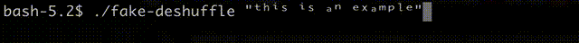
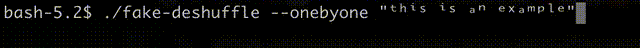

# fake-string-deshuffle
These script creates an animation of deshuffling a string char by char or all at once.

It reminds a brute force string cracker.

Cool to use on your own bash scripts.

Right now I'm using it with super script characters but you can of course edit the characters list to match your style.

#### You can use it like this:

