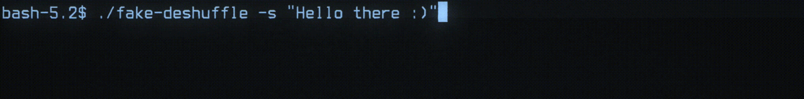
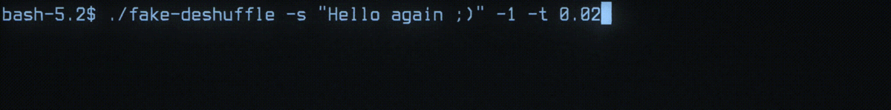
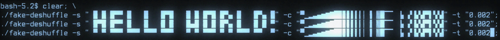

# fake-string-deshuffle
These script creates a cool animation of deshuffling a string char by char or all at once, like a password cracker or so.

### There are a few options to customize the result

```bash
Usage: fake-deshuffle [-1] [-t value] [-c value] -s value
  -h               Display help
  -1               Set one_by_one flag
  -t value         Set speed value (default: 0.04)
  -c value         Set random characters to use (default: АБВГДЕЁЖЗИЙКЛМНОПРСТУФХЦЧШЩЪЫЬЭЮЯабвгдеёжзийклмнопрстуфхцчшщъыьэюяΑΒΓΔΕΖΗΘΙΚΛΜΝΞΟΠΡΣΤΥΦΧΨΩαβγδεζηθικλμνξοπρστυφχψω)
  -s value         Set string value (mandatory)
```


### Examples:

#### All at once (default)


#### Character by character, faster


#### Multiline with custom characters to pick from

